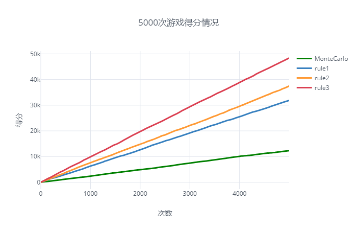
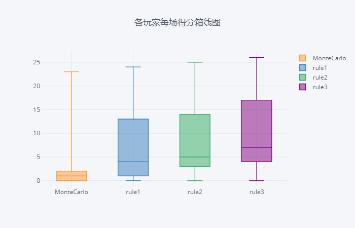

# MonteCarlo Hearts player     运行环境py3
1. 本程序是应用MonteCarloTreeSearch算法在红心大战中出牌。  
   红心大战是非完备信息的博弈游戏，网上常见的代码都是在完备信息下的模拟，AI知道其他玩家的牌再进行搜索。本程序在其基础上进行修改，在本程序中的MonteCarlo模拟时其他玩家的牌的状态是未知的，使用encapsule将MonteCarloAI与正常的游戏隔离开，只提供接口函数来调用。
2. 文件 `encapsule.py` 将其他的类等封装了起来
3. 接口函数为encapsule里的 `MonteCarloPlay`   
4. MonteCarloPlay 的参数如下：  
   `MonteCarloPlay(deck, history_self,history_A,history_B,history_C,history_P0,REPLAY=False):`  
   ____input:  
   deck:           列表，当前玩家手中的牌，如：
                    deck = [Card(point=7, suit=0),Card(point=10, suit=3),Card(point=11, suit=3)]    
   history_self:   同deck列表，当前玩家已出的牌  
   history_A:      同deck列表，玩家A已出的牌  
   history_B:      同deck列表，玩家B已出的牌  
   history_C:      同deck列表，玩家C已出的牌  
   history_P0:     列表，每个回合第一个发牌的人的index。当前玩家:0, A:1, B:2, C:3
                    如：history_P0 = [0,1,1]表示第一回合是当前玩家先出的牌，第二回合玩家1先出的牌，第三回合还是玩家1先出的牌
   
   ____output:  
   out_card: Card类型，选定的一张牌
   
5. 使用时需要导入的文件
    ```
    import collections
    Card = collections.namedtuple('Card', ['point', 'suit'])
    from encapsule import MontoCarlePlay
    ```
6. 当前每次运行时间为1s，可在Variables.py中修改该变量monteCarloTime
7. 可运行gameTest.py测试，该示例采用了1个MonteCarloPlay和3个规则玩家。
8. 对gameTest做5000次模拟测试的得分情况：  
     
   
9.  提升点：
    1. MonteCarlo模拟中的选择的三个玩家的策略可以改进(在Player模块中添加不同的策略供play函数调用)
    2. 优化损失函数，在得分情况中优化全红的损失，一旦发现某些步骤效果差时就终止分裂