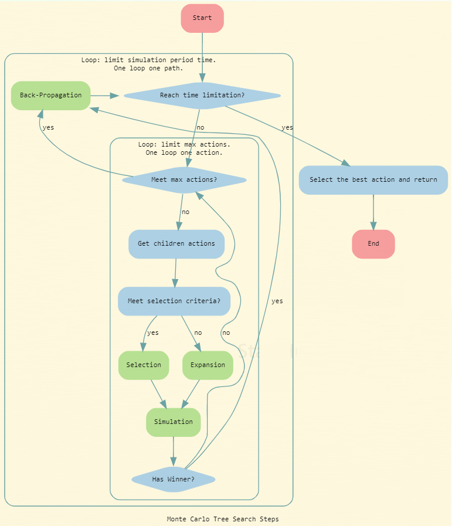

# 简介
蒙特卡罗方法（或蒙特卡罗实验）是一类广泛的计算算法，又叫统计模拟方法，依赖于重复随机抽样来获得数值结果。它使用随机数（或伪随机数）来解决计算的问题，是一类重要的数值计算方法。该方法的名字来源于世界著名的赌城蒙特卡罗，而蒙特卡罗方法正是以概率为基础的方法。他们的基本思想是使用随机性来解决原则上可能确定的问题。它们通常用于物理和数学问题，并且在难以或不可能使用其他方法时最有用。蒙特卡罗方法主要用于三个问题类：优化，数值积分和从概率分布生成抽取。  
基于蒙特卡罗方法的蒙特卡罗树搜索的技术，主要应用在搜索游戏中的最佳策略选择。在搜索树中组织可能的移动，并且使用大量随机模拟来估计每个移动的长期效益。
# 步骤
蒙特卡罗树搜索（MCTS）方法有四个步骤：  
1. 选择：从树的根节点开始，根据选择策略依次选择最佳子节点。选择策略的好坏直接影响搜索的好坏，比如选择平均赢数最多就是一种策略。而目前广泛采用的策略为UCT。 
2. 扩展：将一个或多个可行的选择（牌）添加为该叶节点的子节点。  
3. 模拟：从该节点开始玩模拟游戏，一直向下扩展直到游戏结束本次模拟终止。模拟策略最简单的可以选择随机策略，在可选的情况中随机选择，此出加入先验知识改进模拟策略可使效果显著提升。
4. 反向传播：使用该模拟游戏的结果来更新节点及其祖先，确定最初的根节点的选择。    
[注] 初始状态没有统计信息，先做扩展

# 流程图
一个游戏玩法的组合可能是一个很大的数，通过设置参数calculation_time来控制时间。每次模拟一条路径，模拟完后，检测一下是否到时。一条路径就是从游戏的当前状态到对局结束的所有步骤。尽管游戏的玩法组合数会很大。但是一个游戏的正常步骤却不会很大，也可以通过另外一个参数max_actions来控制，以免出现步骤太长的情况。  

参考：
1. https://en.wikipedia.org/wiki/Monte_Carlo_method
2. https://en.wikipedia.org/wiki/Monte_Carlo_tree_search
3. https://jeffbradberry.com/posts/2015/09/intro-to-monte-carlo-tree-search/
4. https://www.cnblogs.com/steven-yang/p/5993205.html